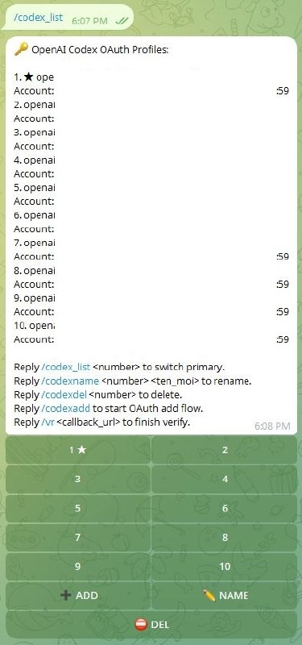

# codex-list

Plugin local cho OpenClaw để quản lý **OpenAI Codex OAuth profiles**.
Sử dụng trong cửa sổ chat Telegram 

🍎 macOS · 🐧 Linux · 🐳 Docker

## Demo



## Công dụng

- xem danh sách profile Codex local
- đổi profile primary nhanh
- đổi tên profile local
- xóa profile local
- add profile mới bằng OAuth
- verify callback OAuth ngay trong chat

## Lệnh

```text
/codex_list
/codex_list <number>
/codexname <number> <ten_moi>
/codexdel <number>
/codexadd
/vr <callback_url>
```

> Ghi chú: `HEALTH` đang tạm tắt để sửa tiếp.

## Cài bằng prompt cho OpenClaw khác

Dán nguyên prompt này cho máy OpenClaw cần cài:

```text
Cài plugin `codex-list` từ repo `https://github.com/dinhlinh86/codex_list` cho máy OpenClaw này.

Yêu cầu:
1. Clone repo về máy local.
2. Copy các file sau vào `~/.openclaw/extensions/codex-list/`:
   - `openclaw.plugin.json`
   - `index.js`
   - `oauth-helper.py`
   - `README.md`
3. Đảm bảo `oauth-helper.py` có quyền chạy:
   chmod +x ~/.openclaw/extensions/codex-list/oauth-helper.py
4. Bật plugin `codex-list` trong `~/.openclaw/openclaw.json`:
   - thêm `codex-list` vào `plugins.allow`
   - thêm `plugins.entries.codex-list.enabled = true`
5. Test plugin trước; nếu plugin chưa hoạt động thì reload/restart OpenClaw gateway theo cách phù hợp với môi trường hiện tại (ví dụ `openclaw gateway restart`, hoặc với Docker thì restart/recreate container), rồi test lại. Không tự kill process thủ công.
6. Test các lệnh:
   - `/codex_list`
   - `/codexadd`
   - `/vr <callback_url>`
   - `/codexname <number> <ten_moi>`
   - `/codexdel <number>`
7. Nếu có file runtime cũ bị kẹt thì dọn:
   - `~/.openclaw/extensions/codex-list/oauth-state.json`
   - `~/.openclaw/extensions/codex-list/oauth-runtime/`

Lưu ý:
- chỉ dừng khi chạy hết lệnh hoặc lỗi phải thông báo. 
- cập nhật từng bước
```
